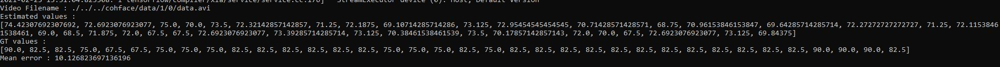
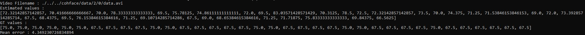
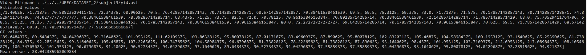

# COHFACE & SYNTHETIC datasets Training

<em> Author : Florian GIGOT </em>

## Overview

### Number of session : 14 (save-1)

- 1 session  = 10 epochs
- COHFACE = compressed video
- UBFC2 = not compressed video

#### Validation tests

Dataset | Result (accuracy) 
 - | -:
SYNTHETIC |  75.55%
COHFACE | 52,15%
UBFC2 | 2.65%

#### Real-world tests
Video | Mean error 
 - | -:
COHFACE Subject 1 vid 0 |  12.36 bpm
COHFACE Subject 2 vid 0 | 6.25 bpm
UBFC2 Suject 1| 27.43 bpm
UBFC2 Subject 3 | 34.43 bpm

### Number of session : 20 (save-2)

- 1 session  = 10 epochs
- COHFACE = compressed video
- UBFC2 = not compressed video

#### Validation tests

Dataset | Result (accuracy)
 - | -:
SYNTHETIC |  88,08%
COHFACE | 48.47%
UBFC2 | 3.97%

#### Real-world tests
Video | Mean error 
 - | -:
COHFACE Subject 1 vid 0 |  18.26 bpm
COHFACE Subject 2 vid 0 | 5.69 bpm
UBFC2 Suject 1| 42.12 bpm
UBFC2 Subject 3 | 37.19 bpm

## Details

### 14 sessions

#### Tests validation

#### COHFACE Subject 1 vid 0

#### COHFACE Subject 2 vid 0

#### UBFC2 Suject 1

#### UBFC2 Subject 3

### 20 sessions

#### Tests validation

#### COHFACE Subject 1 vid 0

#### COHFACE Subject 2 vid 0

#### UBFC2 Suject 1

#### UBFC2 Subject 3
