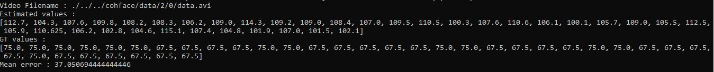
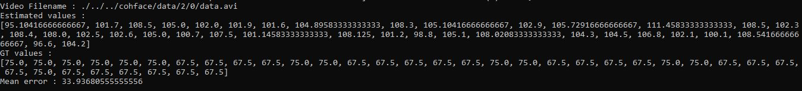
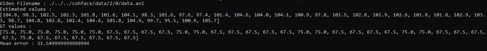
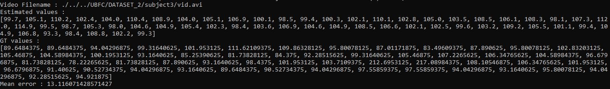

# UBFC2 & SYNTHETIC datasets Training

<em> Author : Florian GIGOT </em>

## Overview

### Number of session : 14 (save-1)

- 1 session  = 10 epochs
- COHFACE = compressed video
- UBFC2 = not compressed video

#### Validation tests
<table>
    <thead>
        <th>Dataset</th>
        <th>Result (accuracy)</th>
    </thead>
    <tbody>
        <tr>
            <td>SYNTHETIC</td>
            <td>65.32%</td>
        </tr>
        <tr>
            <td>COHFACE</td>
            <td>0.61%</td>
        </tr>
        <tr>
            <td>UBFC2</td>
            <td>9.27%</td>
        </tr>
    </tbody>
</table>

#### Real-world tests

<table>
    <thead>
        <th>Video</th>
        <th>Mean error </th>
    </thead>
    <tbody>
        <tr>
            <td>COHFACE Subject 1 vid 0</td>
            <td>28.04 bpm</td>
        </tr>
        <tr>
            <td>COHFACE Subject 2 vid 0</td>
            <td>37.05 bpm</td>
        </tr>
        <tr>
            <td>UBFC2 Suject 1</td>
            <td>4.94 bpm</td>
        </tr>
        <tr>
            <td>UBFC2 Subject 3</td>
            <td>13.98 bpm</td>
        </tr>
    </tbody>
</table>

### Number of session : 20 (save-2)

- 1 session  = 10 epochs
- COHFACE = compressed video
- UBFC2 = not compressed video

#### Validation tests
<table>
    <thead>
        <th>Dataset</th>
        <th>Result (accuracy)</th>
    </thead>
    <tbody>
        <tr>
            <td>SYNTHETIC</td>
            <td>83,37%</td>
        </tr>
        <tr>
            <td>COHFACE</td>
            <td>1.23%</td>
        </tr>
        <tr>
            <td>UBFC2</td>
            <td>9.93%</td>
        </tr>
    </tbody>
</table>

#### Real-world tests

<table>
    <thead>
        <th>Video</th>
        <th>Mean error </th>
    </thead>
    <tbody>
        <tr>
            <td>COHFACE Subject 1 vid 0</td>
            <td>16.94 bpm</td>
        </tr>
        <tr>
            <td>COHFACE Subject 2 vid 0</td>
            <td>33.96 bpm</td>
        </tr>
        <tr>
            <td>UBFC2 Suject 1</td>
            <td>5.99 bpm</td>
        </tr>
        <tr>
            <td>UBFC2 Subject 3</td>
            <td>11.58 bpm</td>
        </tr>
    </tbody>
</table>

### Number of session : 26 (save-3)

- 1 session  = 10 epochs
- COHFACE = compressed video
- UBFC2 = not compressed video

#### Validation tests
<table>
    <thead>
        <th>Dataset</th>
        <th>Result (accuracy)</th>
    </thead>
    <tbody>
        <tr>
            <td>SYNTHETIC</td>
            <td>88,05%</td>
        </tr>
        <tr>
            <td>COHFACE</td>
            <td>0.00%</td>
        </tr>
        <tr>
            <td>UBFC2</td>
            <td>11.92%</td>
        </tr>
    </tbody>
</table>

#### Real-world tests

<table>
    <thead>
        <th>Video</th>
        <th>Mean error </th>
    </thead>
    <tbody>
        <tr>
            <td>COHFACE Subject 1 vid 0</td>
            <td>23.68 bpm</td>
        </tr>
        <tr>
            <td>COHFACE Subject 2 vid 0</td>
            <td>31.54 bpm</td>
        </tr>
        <tr>
            <td>UBFC2 Suject 1</td>
            <td>8.69 bpm</td>
        </tr>
        <tr>
            <td>UBFC2 Subject 3</td>
            <td>13.11 bpm</td>
        </tr>
    </tbody>
</table>

## Details

### 14 sessions

#### Tests validation

#### COHFACE Subject 1 vid 0

#### COHFACE Subject 2 vid 0

#### UBFC2 Suject 1

#### UBFC2 Subject 3

### 20 sessions

#### Tests validation

#### COHFACE Subject 1 vid 0

#### COHFACE Subject 2 vid 0

#### UBFC2 Suject 1

#### UBFC2 Subject 3

### 26 sessions

#### Tests validation

#### COHFACE Subject 1 vid 0

#### COHFACE Subject 2 vid 0

#### UBFC2 Suject 1

#### UBFC2 Subject 3
